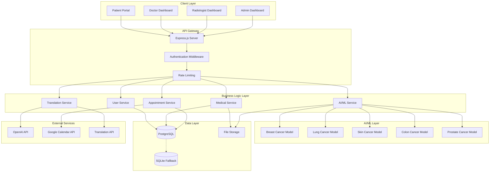
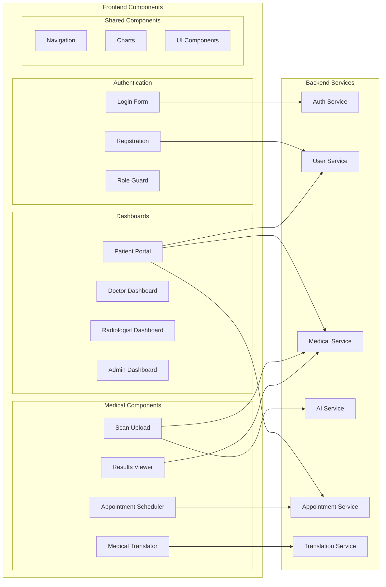
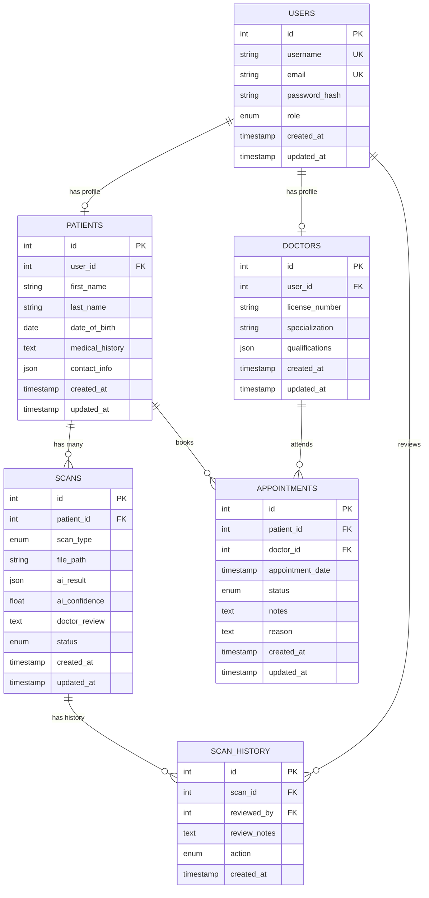
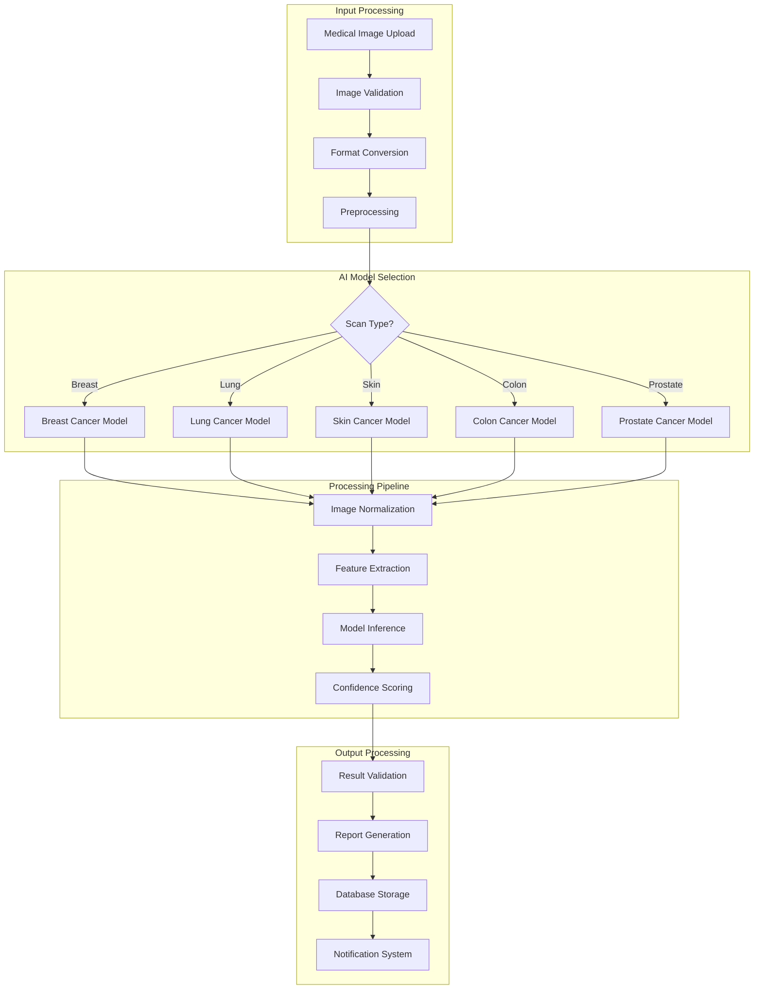
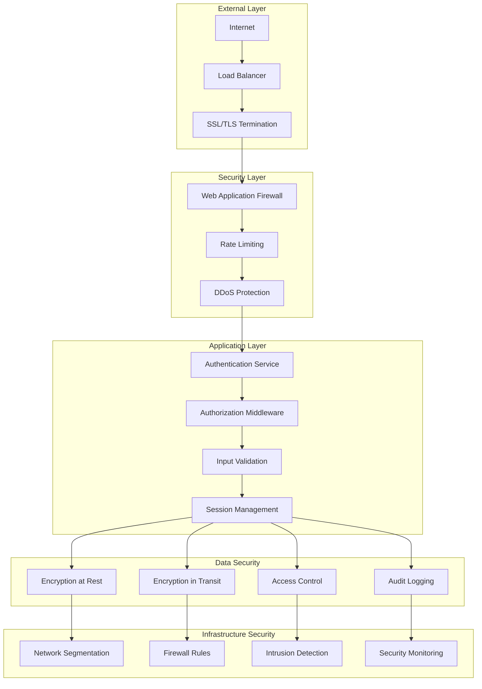
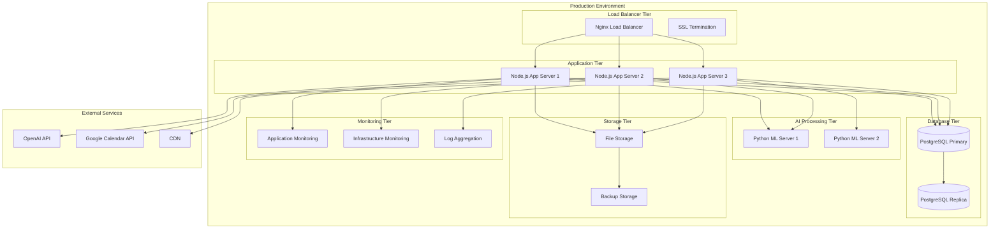
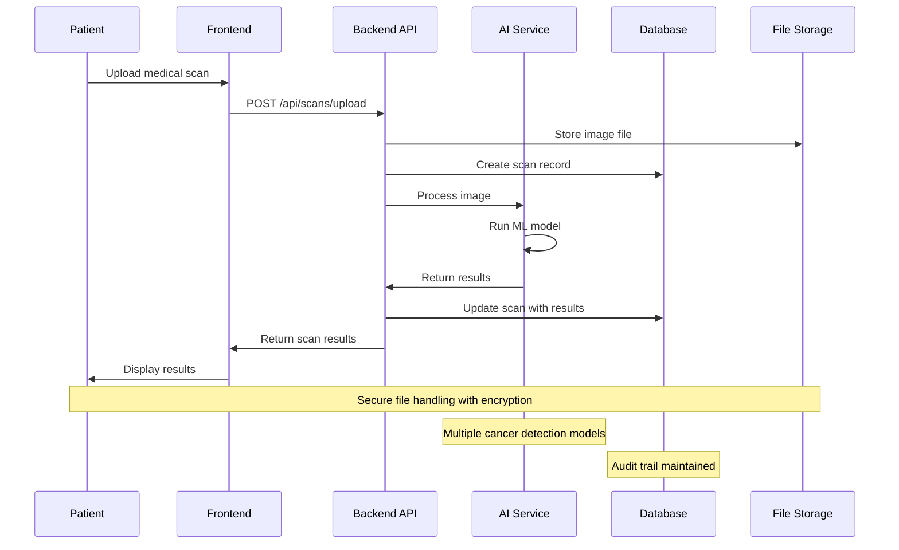
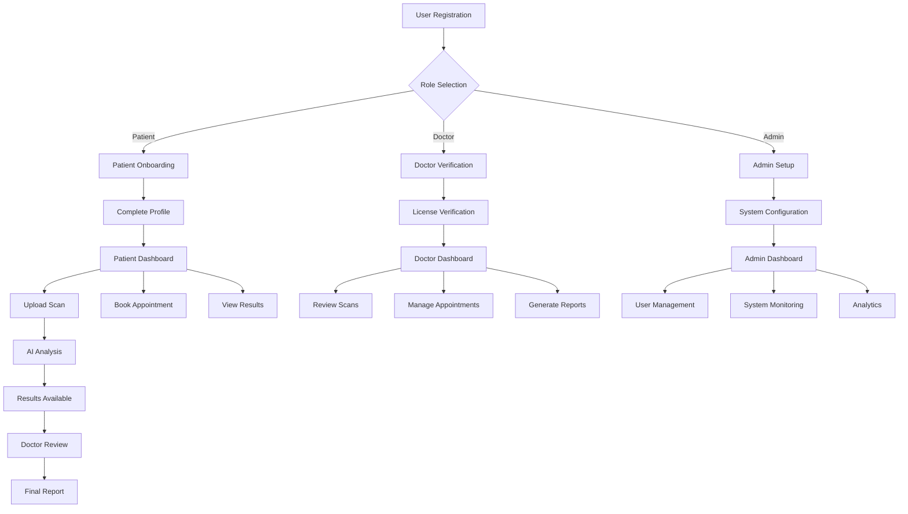
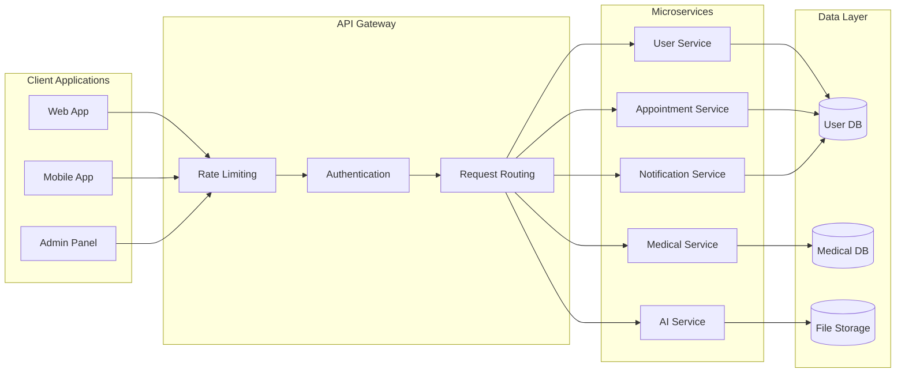
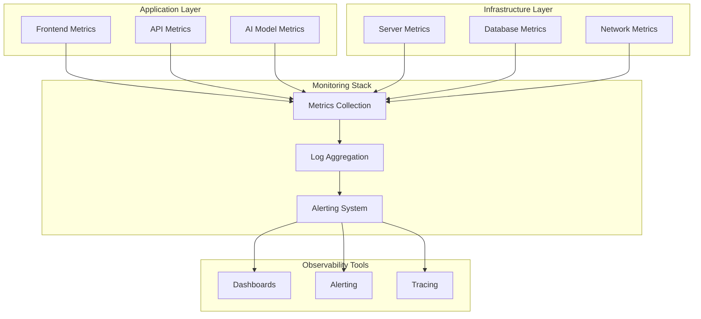

# HealthAI Assistant - Architecture Diagrams

## 1. System Overview Diagram

## 2. Component Architecture Diagram

## 3. Database Schema Diagram

## 4. AI/ML Pipeline Architecture

## 5. Security Architecture Diagram

## 6. Deployment Architecture Diagram

## 7. Data Flow Diagram

## 8. User Journey Flow

## 9. API Architecture Diagram

## 10. Monitoring and Observability

---

*These architectural diagrams provide a comprehensive view of the HealthAI Assistant system design and can be used for development, deployment, and maintenance planning.*